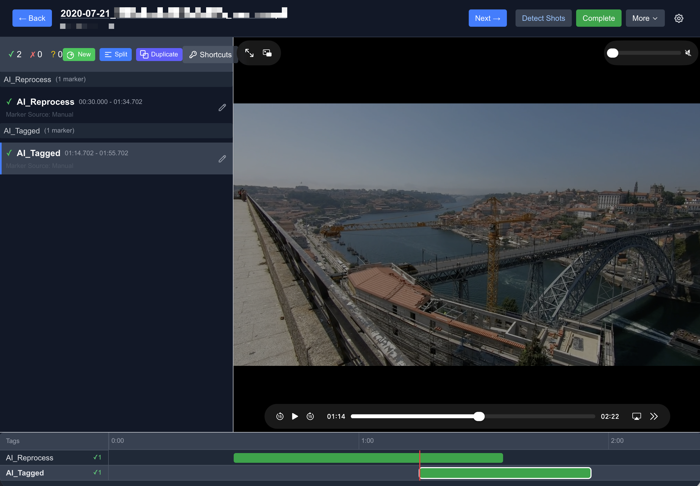
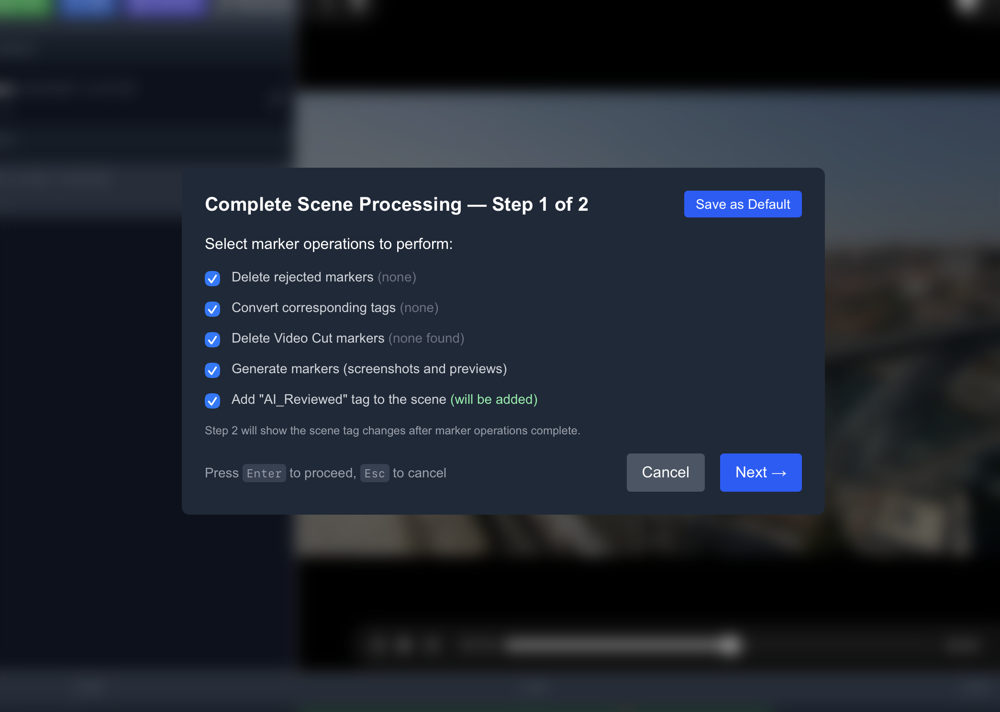
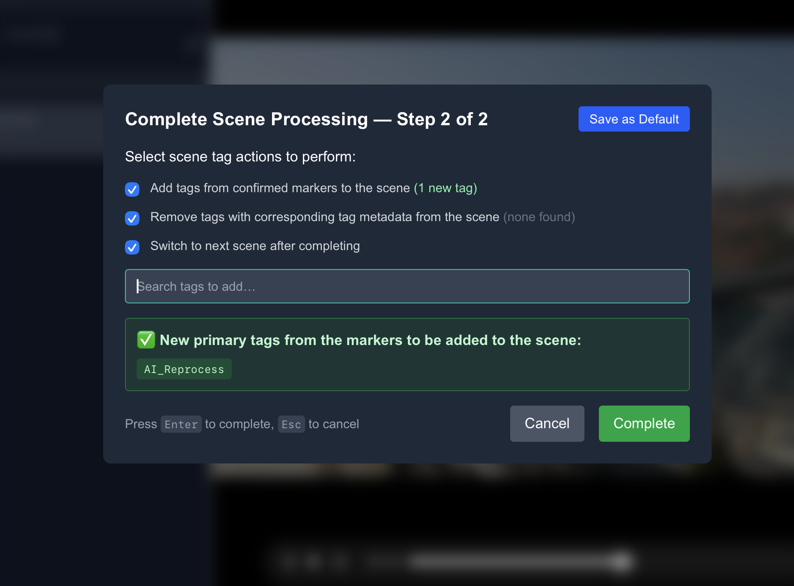

# Stash Marker Studio Plus



> **Enhanced fork** of [stash-marker-studio](https://github.com/MinasukiHikimuna/stash-marker-studio) by MinasukiHikimuna. Fully compatible with the original workflow, with new features added on top.

Stash Marker Studio Plus is a companion app for Stashapp that makes working with video markers and tags much easier. It was mainly designed to support reviewing markers from [Skier's NSFW AI model](https://github.com/skier233/nsfw_ai_model_server) but works with any markers.

The core workflow:

- Markers always have a single, actual tag stored as primary tag.
- Additional tags on markers are used only for metadata (confirmed, rejected, source).
- During review, confirm or reject markers using keyboard shortcuts. Rejected markers can be bulk-deleted.
- On completion, all AI/placeholder tags are removed and only confirmed markers' tags are saved to the scene. Pre-existing tags not originating from markers are left untouched.

The app is heavily keyboard-driven — many features are only accessible via keyboard shortcuts. Left hand modifies, right hand navigates.


---

## What's New in Plus

These features are additions beyond the original stash-marker-studio:

### In-App Shot Boundary Detection
PySceneDetect now runs directly inside the app — no external script required. A **Detect Shots** button in the scene header triggers detection on the current scene, creates shot boundary markers automatically, and tags the scene when complete. If shot boundary markers already exist, the button reads **Re-detect Shots** and removes old ones before creating new ones.

### Inline Marker Time Editing
Edit marker start and end times directly in the marker list. Set either time to the current video position with a single button press. Tag assignment is also integrated into the edit row.

### Completion Modal with Tag Preview
A two-page completion modal shows exactly which tags will be added to and removed from the scene before committing. Page 2 includes manual tag search (autocomplete for any non-AI Stash tag) and lets you remove manually added tags before finalising.



### Next Scene Navigation
After completing a scene, navigate directly to the next unreviewed scene from your session list — no need to return to the search page.

### Scene Metadata in Header
The scene header now shows studio name, star rating, play count, and O-counter at a glance. The scene title is a clickable link that opens the scene in Stashapp in a new tab.

### Advanced Marker Operations
- **Duplicate** a marker
- **Split** a marker at the current playhead position
- **Split shot boundary** markers
- **Copy/paste** timing data between markers
- **Merge** properties from one marker into another

### Dynamic Keyboard Shortcuts
Keyboard shortcuts are configurable in settings. The shortcut modal groups shortcuts by left-hand (modify) and right-hand (navigate) for quick reference.

### Reliability & Architecture
Full Redux Toolkit migration for all marker state management. Navigation uses marker IDs for reliable selection. Toasts and modals no longer render underneath timeline markers.

---

## Full Feature Overview

### Timeline Navigation

**Swimlane Navigation**: Move between marker categories using arrow keys. Navigation follows the visual swimlane order top to bottom.

**Timeline Zoom**: Adjust temporal resolution for detailed or broad views. Zoom maintains the playhead as focal point with min/max limits.

**Playhead-Based Selection**: Automatically selects markers based on current video position. Updates as the video plays.

**Timeline Centering**: Centers the timeline on the current playhead while maintaining zoom level.

### Marker Review

**Unprocessed Marker Navigation**: Navigate between markers needing review — both within the current swimlane and globally across all swimlanes. 

**Video Playback**: Play/pause, seek, and frame-precise stepping. Frame operations detect and use the video's actual frame rate.

**Marker States**: Toggle markers between confirmed, rejected, and unprocessed. Repeated key presses cycle back to unprocessed, making corrections easy.

### Marker Creation and Editing

**Multiple Creation Methods**: Create regular markers, shot boundary markers, duplicates, and splits. All operations give immediate visual feedback.

**Precise Timing**: Frame-accurate timing adjustments with validation to prevent invalid configurations.

**Shot Boundary Integration**: Navigate between detected shot boundaries, with fallback to manual shot boundary markers.

### AI Feedback Collection

**Independent Feedback System**: Flag a marker for AI feedback — it gets rejected, but feedback data persists independently of the marker's lifecycle.

**Screengrab Generation**: Captures video frames for each collected marker when exporting, providing visual context for AI training data.

**Export**: Feedback exported as zip files with marker metadata and screengrabs. All data is stored locally in your browser — nothing is sent anywhere automatically.

### Tag Management

**Corresponding Tag System**: Link tags together by setting a tag's description in Stashapp to `Corresponding Tag: TagName`. Linked tags share a swimlane. A gear icon on each swimlane lets you manage these relationships.

**Marker Groups**: Organise related swimlanes into named visual groups using the marker group parent tag system (e.g. "1. Positions", "2. Actions").

---

## Workflows

### AI-Generated Marker Review

1. Load scene with existing AI-generated markers
2. Navigate through unprocessed markers using keyboard shortcuts
3. Confirm or reject markers based on accuracy
4. Use corresponding tag conversion to map AI tags to final tags
5. Optionally collect feedback on problematic AI predictions
6. Complete review — tag preview modal shows exactly what will change

### Example End-to-End Workflow

1. New scene added to Stashapp
2. Scene matched with Tagger feature in Stashapp
3. `AI_TagMe` tag set and Skier's AI model applied
4. Click **Detect Shots** in the scene header (PySceneDetect runs in-app)
5. Review markers: confirm or reject using keyboard shortcuts
6. Convert corresponding tags (AI tags → real tags)
7. Complete scene — modal previews tag changes, then advances to next scene

### Manual Marker Creation

1. Create markers at current video position during playback
2. Set precise start/end times using frame-accurate controls or the ▶ button
3. Apply tags and organise using marker groups
4. Duplicate and modify existing markers for efficiency

---

## Getting Started

Requires Stash version 0.28 or later (introduced start/end time support for markers).

### Quick Start with Docker Compose (Recommended)

```bash
# Copy sample files
cp app-config.sample.json app-config.json
cp docker-compose.sample.yaml docker-compose.yaml

# Edit docker-compose.yaml to set your media library path, then:
docker compose up -d
```

Open [http://localhost:3000](http://localhost:3000) and use the configuration UI to set up your Stashapp connection and tag IDs.

The media library volume (`/path/to/your/media:/data`) is required for in-app shot boundary detection. It must match the path Stash uses for the same files so video paths from the GraphQL API resolve correctly.

### Quick Start with Docker Run

```bash
cp app-config.sample.json app-config.json

docker run -d -p 3000:3000 \
  -v ./app-config.json:/app/app-config.json \
  -v /path/to/your/media:/data \
  ghcr.io/dnke8088/stash-marker-studio-plus:latest
```

### Build from Source

```bash
git clone https://github.com/dnke8088/stash-marker-studio-plus
cd stash-marker-studio-plus
cp app-config.sample.json app-config.json
docker build -t stash-marker-studio-plus .
docker run -p 3000:3000 -v ./app-config.json:/app/app-config.json stash-marker-studio-plus
```

### Running for Development

```bash
npm install
cp app-config.sample.json app-config.json
npm run dev
```

---

## Configuration

### Required Tags

Create the following tags in Stashapp. Names are customisable.

**Marker Status Tags:**

- **Status Confirmed** — assigned to approved markers (e.g. `Marker Status: Confirmed`)
- **Status Rejected** — assigned to rejected markers until deletion (e.g. `Marker Status: Rejected`)
- **Source Manual** — assigned to manually created markers (e.g. `Marker Source: Manual`)
- **AI Reviewed** — assigned to scenes after review completion (e.g. `AI_Reviewed`)

**Marker Grouping Tags (Optional):**

- **Marker Group Parent** — parent tag for organising marker groups (e.g. `Marker Group`)
  - Create child tags with pattern `Marker Group: N. DisplayName`

**Shot Boundary Tags (Optional):**

- **Shot Boundary** — primary tag for shot boundary markers (e.g. `Video Cut`)
- **Source Shot Boundary** — source tag for PySceneDetect markers (e.g. `Marker Source: PySceneDetect`)
- **AI Tagged** — tag for scenes ready for shot boundary processing (e.g. `AI_Tagged`)
- **Shot Boundary Processed** — tag applied after processing (e.g. `Scenes: PySceneDetect: Processed`)

### Server Configuration

Configure your Stashapp connection in the app's configuration interface:

- **Stashapp URL** — your Stash GraphQL endpoint (typically `http://localhost:9999/graphql`)
- **API Key** — from Stashapp Settings → Security (leave empty if no auth required)

---

## Development

- Next.js 15 with App Router
- TypeScript
- Tailwind CSS
- GraphQL
- Redux Toolkit
- Jest
